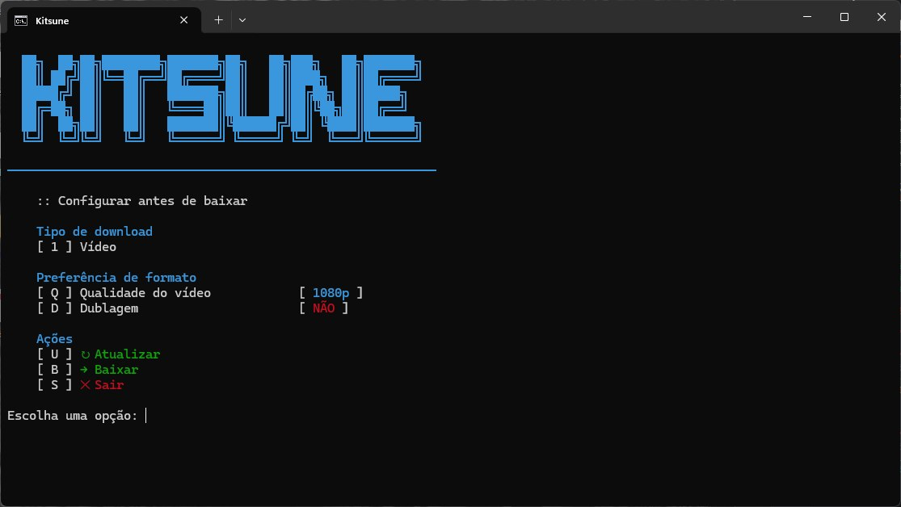

# Kitsune

Kitsune é uma interface interativa em português que elimina a necessidade de aprender linha de comando.



---

## Instalação (Windows)
### Instalar todas as dependências de uma vez
Abra o **Terminal** (PowerShell ou CMD) como Administrador e cole:
```powershell
winget install -e --id yt-dlp.yt-dlp mikf.gallery-dl
```

### Clone ou baixe manualmente o arquivo em [Releases](https://github.com/KindDyu/Kitsune/releases)
```powershell
git clone https://github.com/KindDyu/Kitsune.git
```

## Como Funciona?
1. Escolha o **Tipo de download** com "[ 1 ]".
   - Tipo de download: **Vídeo** (padrão), **Imagem** e **Áudio**.
   - Mude as **Preferências de formato**: **Qualidade** com "[ Q ]" e **Dublagem** com "[ D ]".
2. Em **Ações**:
   - [ U ] para Atualizar (Update) as ferramentas (`yt-dlp` e `gallery-dl`)
   - [ B ] para prosseguir ao download
   - [ S ] para sair

> [!WARNING]
> O arquivo baixado será salvo na mesma pasta onde o `.bat` está localizado.

## Contribuições (mesmo não sendo programador)
Se tiver sugestões ou encontrou um bug, me avise.
- ["Create new issue"](https://github.com/KindDyu/Kitsune/issues/new)

## Créditos
Baseado no trabalho incrível de [domocorn](https://github.com/domocorn/yt-dlp-interactive-batch).

---

> **Nota do autor:** utilize, modifique, compartilhe livremente. Não tenho interesse em monetizar. Só quero que outras pessoas parem de sofrer com ferramentas que deveriam ser simples.
